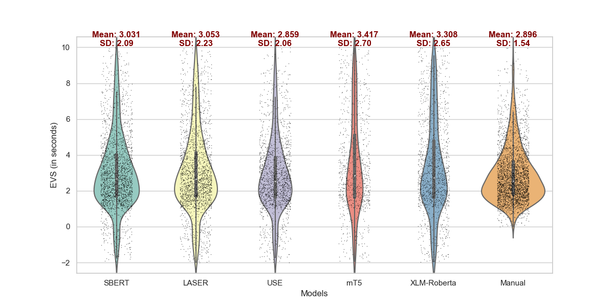
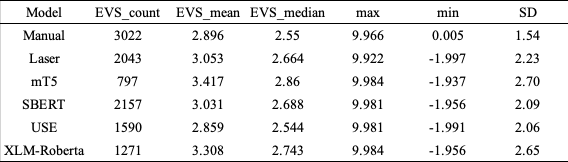

# Automated-EVS-Measurement for Interpreting Studies

This project aims to automate the measurement of Ear-Voice-Span (EVS) in Interpreting Studies using an end-to-end pipeline consisting of Automatic Speech Recognition (ASR), Sentence Boundary Detection (SBD), and Cross-Lingual Alignment.

**## Pipeline Overview**

1. **ASR**: Use WhisperX ASR to convert audio files into text with timestamps at the word level.
2. **SBD**: Process ASR output with various SBD models (default: Stanza).
3. **Cross-Lingual Alignment**: Align the sentences from two languages (default: USE with a similarity threshold of 0.5) and extract EVS.

**## Getting Started**

1. Clone this repository:
```
git clone https://github.com/MMRita/automated-evs-measurement.git
```

2. Install the dependencies using pip:
```bash
pip install -r requirements.txt
```
3. Set up the ASR model (WhisperX) following the instructions in the [WhisperX repository](https://github.com/m-bain/whisperX).

**## Usage**

**### Audios ASR**
```bash
Whisperx <examples/sample01.wav> --language <X>
```
Replace `<examples/sample01.wav>` with the name of the audio you want to transcribe and replace `<X>` with the language of your audio transcribe. Currently, default models are provided for {en, fr, de, es, it, ja, zh, nl, uk, pt}. After running WhisperX, five files will be generated, in which the file ending with ".word.srt" will be used for the next steps.

**### Use Default Models to Generate EVS**

Run the `main.py` script:
```bash
python main.py <source_language> <target_language> <source_path> <target_path>
```
Replace `<source_language>` and `<target_language>` with the respective languages, e.g., {en, fr, de, es, it, ja, zh, nl, uk, pt}. Replace `<source_path>` and `<target_path>` with the respective ".word.srt" file paths.

After running the code, three files will be generated:

- source_language_sentences.txt (for SBD process)
- target_language_sentences.txt (for SBD process)
- cross_lingual_alignment.txt (for cross-lingual alignment process and contains EVS values)

**## Customizing the Pipeline**

To use different models for SBD or Cross-Lingual Alignment and set different similarity thresholds for the Cross-Lingual Alignment process, please refer to the individual scripts provided for each model. You can find their supporting languages and processing models on their official sites:

**### Sentence Boundary Detection Models**

- `punkt.py`: [NLTK's Punkt tokenizer](https://www.nltk.org/api/nltk.tokenize.html) (Additional dependency: nltk)
```bash
python `<script_name.py>` `<path_to_your_file.word.srt>`
```
- `spacy.py`: [Spacy](https://spacy.io/) (Additional dependencies: spacy)
```bash
python `<script_name.py>` `<en_core_web_sm>` `<path_to_your_file.word.srt>`
```
- `stanza.py`: [Stanza](https://stanfordnlp.github.io/stanza/) (default) (Additional dependency: stanza)
```bash
python `<script_name.py>` `<path_to_your_file.word.srt>`
```

**### Cross-Lingual Alignment Models**

- `LASER.py`: [LASER](https://github.com/facebookresearch/LASER) (Additional dependency: laserembeddings)
- `SBERT.py`: [SBERT](https://www.sbert.net/) (Additional dependency: sentence-transformers)
- 
- `USE.py`: [Universal Sentence Encoder](https://tfhub.dev/google/collections/universal-sentence-encoder/) (default) (Additional dependencies: tensorflow, tensorflow-hub, tensorflow-text)
- `XLM-Roberta.py`: [XLM-Roberta](https://huggingface.co/docs/transformers/model_doc/xlm-roberta) (Additional dependency: transformers)

You can modify the respective scripts according to your needs and run them independently.

**##Performance Evaluation**

The robustness and performance of the Automated-EVS-Measurement pipeline have been evaluated in our research on a comprehensive 20-hour English-to-Portuguese SI corpus, encompassing 57 unique audio pairs. Below, we present key findings and figures illustrating the results.





In the figure above, the width of the violin at any given vertical level signifies the density of EVS values, while the outline shape represents the kernel density plot. All automated methods demonstrated longer tails in their distributions compared to the manual approach, an aspect warranting further exploration. The jittered black points overlaid on the violin plot represent individual EVS values, offering a sense of the raw data’s distribution. The bold line in the center of each violin illustrates a box plot, with the range between the upper and lower boundaries representing the IQR, and the center point indicating the median EVS value.


 


The overall accuracy of the EVS mean values generated by the three models is acceptable, with USE outperforming the other two by confining both the MAE and RMSE to less than 0.5. In terms of correlation with the manual approach, USE demonstrates a strong, positive relationship, whereas SBERT and LASER show a moderate correlation.

In conclusion, based on the performance metrics and visualizations presented in this section, SBERT, LASER, and USE models can all generate results that closely resemble those derived from the human approach. This demonstrates the feasibility, at least to a certain degree, of automated measurement of EVS, serving as a promising avenue for future research and applications in simultaneous interpretation studies.

Please note that the complete study and further details can be found in our paper, which is currently under review.

**## Contributing**

If you would like to contribute to this project, please submit a pull request with your proposed changes.

**## License**

This project is licensed under the MIT License. See the [LICENSE](LICENSE) file for more information.


## Contact
For questions or comments, please contact p2111921@mpu.edu.mo. Hope this helps! Let me know if you have any other questions.
